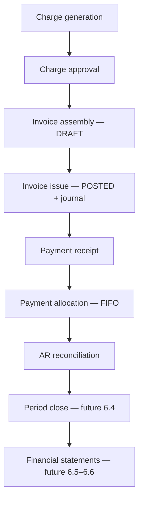

# Accounting Pillars — Implementation Map

AMSAAS financial modules must stand on four pillars. This document maps each pillar to code, schema, and pipeline stages.

## Pillar 1 — Accounting principles (GAAP / IFRS)

| Principle | Requirement | AMSAAS implementation |
|-----------|-------------|----------------------|
| **Double-entry** | Every event = balanced debits and credits | `journal_entries` + `journal_entry_lines`; `chk_balanced` on header; `chk_one_side` per line |
| **Accrual basis** | Revenue recognised when earned | Journal `entry_date` = invoice `issue_date` / billing period, not payment date |
| **Revenue recognition** | Performance obligation over period | `billing_year` / `billing_month` on invoices; `ProrateRentService` for mid-month move-in |
| **Matching principle** | Expenses in same period as revenue | Charge approval → same-period invoice consolidation |
| **Accounting equation** | Assets = Liabilities + Equity | AR increases on invoice post; decreases on payment allocation |

### Immutability matrix

| State | Allowed mutation | Correction |
|-------|------------------|------------|
| DRAFT invoice | Edit fields | Direct edit |
| ISSUED invoice | None | Credit note + re-issue (future) |
| PAID invoice | None | Reversal payment (future) |
| POSTED journal | None | Reversing entry (future) |

Posted journal entries are never updated or deleted.

## Pillar 2 — Financial data integrity

| Standard | Implementation |
|----------|----------------|
| **ISO 4217** | `currency_code` on `journal_entries`; company `currency_code` |
| **Decimal precision** | `NUMERIC(14,4)` on journal lines; `App\Support\Money` (BCMath scale 4) |
| **No float money** | BCMath in billing + journal posting |
| **Idempotency** | Unique `(company_id, source_type, source_id)` on `journal_entries` |
| **Soft deletes** | Financial models use `SoftDeletes`; posted journals are immutable |

## Pillar 3 — Chart of accounts (posting accounts)

Standard property-management posting accounts seeded per company:

```
1110  Cash and Cash Equivalents          (asset)
1115  Bank Accounts                      (asset)
1116  Mobile Money Wallets               (asset)
1117  Cheques in Transit                 (asset)
1120  Accounts Receivable                (asset)
2120  Customer Deposits Payable          (liability)
2130  Deferred Revenue                   (liability)
4100  Rental Income                      (revenue)
4110  Utility Recovery Income            (revenue)
4140  Service Charge Income              (revenue)
4150  Property Sale Revenue              (revenue)
```

Full hierarchy reference (reporting rollups — optional future `parent_account_id`):

```
1000  ASSETS → 1100 Current → 1110 Cash, 1120 AR, 1130 Deposits Held
2000  LIABILITIES → 2100 Current → 2120 Tenant Deposits, 2130 Unearned Rent
3000  EQUITY
4000  REVENUE → 4100 Rental, 4110 Utility, 4140 Services
5000  EXPENSES → 5100 Maintenance, 5130 Bad Debt
```

MVP seeds **posting accounts only** (1110, 1115, 1116, 1117, 1120, 2120, 2130, 4100, 4110, 4140, 4150).

Payment method → receipt account mapping lives in `PostingRuleService`.

Legacy codes from early 6.1 (`1000`, `1200`, `4000`…) resolve via `Account::LEGACY_CODE_ALIASES` in `ChartOfAccountsService::resolvePostingAccount()`.

## Pillar 4 — Financial processing pipeline



### Journal posting triggers (6.2)

| Event | Debit | Credit |
|-------|-------|--------|
| Rental invoice issued | 1120 AR (total) | 4100 Rent + 4110 Utility + 4140 Services |
| Sale invoice issued | 1120 AR (total) | 4150 Property Sale Revenue |
| Payment allocated (rental) | Receipt account by method | 1120 AR |
| Sale payment | Receipt account by method | 1120 AR |
| Customer deposit | Receipt account by method | 2120 Deposits Payable |

## Related files

- `app/Models/Account.php` — chart codes as constants
- `app/Services/Accounting/ChartOfAccountsService.php` — seed + account resolution
- `app/Services/Accounting/JournalEntryService.php` — balanced posting
- `docs/refactoring/PHASE6_PROGRESS.md` — phase tracker
