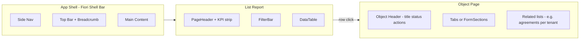

# AMSAAS ERP UI Strategy — Design Systems & Full Rollout

**Goal:** One coherent, operations-first UI across Buildings, Apartments, Tenants, Rental Agreements, Charge Types, Charge Models, Invoices, and the app shell (sidebar, top bar, dashboard).

**Interaction model (canonical):** [`UI_DESIGN_MODEL.md`](./UI_DESIGN_MODEL.md) — five SAP Fiori patterns (Worklist, Object Page, FCL, Smart Filter, Transactional).

**Stack constraint:** Vue 3 + Vite + Tailwind 4 (already in place). Backend is Laravel API with `controls` on resources.

---

## 1. What “operational excellence” means for property ERP

Users spend most time in **high-volume lists** (find → filter → act) and **object workflows** (open record → verify status → post/approve). The UI should optimize for:

| Need | UI pattern |
|------|------------|
| Scan many rows quickly | Dense tables, sticky headers, zebra/hover, monospace IDs |
| Reduce errors | Status badges, disabled actions with tooltips, confirm modals |
| Short paths | Primary action in page header; row actions limited to 2–3 |
| Context | Breadcrumbs, object title + status on detail pages |
| Throughput | Keyboard-friendly filters, clear empty/loading states |
| Trust | Consistent money/date formatting, audit hints on finance screens |

Decorative marketing-style pages (custom fonts per screen, one-off animations) **hurt** ops UX — they are what we are removing from legacy pages like `BuildingsIndex.vue`.

---

## 2. Widely used ERP / enterprise design systems (comparison)

These are the references product teams actually use for B2B ERP—not generic SaaS landing pages.

| System | Owner / used by | Strengths for ops | Vue fit | Recommendation for AMSAAS |
|--------|-----------------|-------------------|---------|---------------------------|
| **[SAP Fiori](https://experience.sap.com/fiori-design-web/)** | SAP S/4HANA, Business One | **Best-in-class ERP patterns**: List Report, Object Page, Worklist, analytical tiles, status semantics | Patterns only (no official Vue kit) | **Primary pattern source** — adopt floorplans, not SAP branding |
| **[Microsoft Fluent 2](https://fluent2.microsoft.design/)** | Dynamics 365, Power Platform | Shell, density, accessibility, data grids | `@fluentui/vue-components` exists | **Secondary** — shell density, focus states, neutral palette |
| **[Oracle Redwood](https://redwood.oracle.com/)** | Oracle Fusion Cloud ERP | Clean enterprise visuals, task flows | Patterns only | Visual inspiration for cards and spacing |
| **[Salesforce Lightning](https://www.lightningdesignsystem.com/)** | Salesforce, many vertical SaaS | Record pages, path components, related lists | SLDS is CSS; heavy for Vue | Borrow “record header + related lists” for Tenant/Agreement detail |
| **[IBM Carbon](https://carbon.design/)** | IBM, some gov/enterprise | Data tables, forms, accessibility | `carbon-components-vue` (community) | Good a11y checklist; optional for complex tables |
| **[Ant Design](https://ant.design/) / Pro** | Many Asia-Pacific ERP/admin builds | Complete admin: table, form, layout, pro templates | **Ant Design Vue** | Strong if you want a **full component library** quickly |
| **[PrimeVue](https://primevue.org/)** | Vue admin / ERP apps (Sakai, Apollo templates) | DataTable, filters, panels, enterprise themes | **Native Vue 3** | **Best Vue-native accelerator** if we add a library |
| **Material Design 3** | Various | Familiar, mobile-friendly | Vuetify | Feels more “consumer” than ERP; lower priority |
| **Tailwind UI / Catalyst** | Startups | Fast polish | Vue ports / headless | Good for marketing; **not** ERP-specific |

### Industry reality

- **SAP Fiori** defines *how* ERP screens behave (most copied unconsciously).
- **Fluent** and **Redwood** define *how* modern cloud ERP looks in 2024–2026.
- **Ant Design Pro** and **PrimeVue** are what teams pick when they need **speed on Vue/React** without building every molecule.

---

## 3. Recommended approach for AMSAAS (hybrid, not a rip-and-replace)

### Decision: **Fiori patterns ([`UI_DESIGN_MODEL.md`](./UI_DESIGN_MODEL.md)) + Fluent density + `components/erp`**

Do **not** introduce four different visual languages (e.g. Syne font on Buildings, DM Sans on Meters, custom CSS per page). Do **not** swap the whole app to Ant Design unless we accept a large dependency and visual reset.

| Layer | Choice | Rationale |
|-------|--------|-----------|
| **Interaction model** | SAP Fiori floorplans | Proven for list → detail → action flows |
| **Visual tokens** | Fluent-inspired neutrals + single accent (indigo/slate already started) | Readable 8px grid, WCAG contrast |
| **Components** | Extend `frontend/src/components/erp/` | Already aligned with Charge Types / Invoices pilots |
| **Optional accelerator** | PrimeVue **only** for DataTable/DatePicker if we hit limits | Tree-shaken imports; theme bridged to Tailwind tokens |
| **Typography** | **Inter** only (already in `index.html`) | One family across shell + pages |
| **Icons** | Heroicons (already in project) | Consistent stroke icons in nav and tables |

### Fiori floorplans → AMSAAS pages

| Fiori floorplan | AMSAAS module | Route pattern |
|-----------------|---------------|---------------|
| **Overview / Dashboard** | Dashboard | `/dashboard` — KPI tiles + exceptions queue |
| **List Report** | Buildings, Apartments, Tenants, Agreements, Charge Types/Models, Invoices | `*Index.vue` — same template |
| **Object Page** | Building show, Tenant edit, Agreement show, Invoice show | `*Show.vue` / `*Edit.vue` |
| **Wizard** | Create flows (optional) | Multi-step `FormPageLayout` for Agreement create |
| **Worklist** (optional later) | Billing batch / meter reading approval | Dedicated queue page |

---

## 4. Target design tokens (single source of truth)

Extend `frontend/src/styles/erp.css` (and retire per-page `<style>` blocks):

| Token | Value (light) | Use |
|-------|-----------------|-----|
| `--erp-bg` | slate-50 | Page background |
| `--erp-surface` | white | Panels, table |
| `--erp-border` | slate-200 | Dividers |
| `--erp-text` | slate-900 | Headings |
| `--erp-text-muted` | slate-500 | Descriptions |
| `--erp-accent` | indigo-600 | Primary actions, active nav |
| `--erp-danger` | red-600 | Void, delete, overdue |
| `--erp-success` | emerald-600 | Posted, active, paid |
| `--erp-warning` | amber-600 | Draft, pending reading |

**Density:** default row height **40px** (comfortable); compact mode **32px** for finance lists (optional prop on `DataTable`).

**Money:** always `tabular-nums`, right-aligned, currency from building/company context.

---

## 5. Shell redesign (`DashboardLayout.vue`)

Replace bespoke sidebar CSS with **erp shell** primitives:

| Area | Change |
|------|--------|
| Sidebar | Fixed 240px, grouped nav (Operations / Finance / System), active state = accent bar + weight |
| Top bar | Breadcrumb from route meta, global search placeholder (phase 2), user menu |
| Content | `main` uses `erp-page` padding only; pages do not set `min-h-screen` |
| Theme | Light default; dark via `data-theme` using same tokens |

New components to add:

- `AppShell.vue` — layout wrapper (extract from DashboardLayout)
- `SideNav.vue` / `TopBar.vue`
- `Breadcrumbs.vue` — driven by `route.meta.breadcrumb` or naming convention

---

## 6. Module-by-module screen spec

### Operations

| Module | List page | Detail / form | Ops notes |
|--------|-----------|---------------|-----------|
| **Dashboard** | KPI grid (`KpiCard`) + `AlertBanner` for exceptions + quick links | — | “Morning checklist”: overdue invoices, draft agreements, missing readings |
| **Buildings** | List Report: name, code, units, currency, status | Object: address, floors, link to apartments | Primary: Add building |
| **Apartments** | Filter by building, unit, status | Link to active agreement | Bulk status rare; focus filters |
| **Tenants** | Search name/email/phone; status | Tabs: Profile, Agreements, Invoices | Related lists on object page |
| **Rental agreements** | Status filter (draft/active/ended), building | Object: parties, dates, charges, state machine actions | Actions gated by `controls` + state |
| **Meters / readings** | (Phase 2 nav) same List Report | Reading entry form | Keep in Operations group |

### Finance

| Module | List page | Detail / form | Ops notes |
|--------|-----------|---------------|-----------|
| **Charge types** | ✅ Pilot done | Standard `FormPageLayout` for create/edit | Category + GL mapping visible in table |
| **Charge models** | ✅ Pilot done | Show tiers/rules on object page | Version/status prominent |
| **Invoices** | ✅ Pilot done | Show: line items, PDF, issue action | Batch link in header |
| **Payments** | Quarantined until Phase 3 | — | Nav disabled (already) |

---

## 7. Component gaps to build (robustness)

| Component | Purpose |
|-----------|---------|
| `ObjectPageHeader` | Title, subtitle, status badge, action group (Fiori object header) |
| `RelatedListPanel` | Embedded table on show pages (e.g. invoices for tenant) |
| `KpiStrip` | Row of 3–5 `KpiCard` under list header |
| `Breadcrumbs` | Shell navigation |
| `DetailTabs` | Object page sections |
| `MoneyCell` | Formatted amount + currency |
| `DateCell` | Locale-aware dates |
| `RowActions` | Overflow menu when >3 actions |
| `BulkActionBar` | Appears when rows selected (invoices batch) |

All list pages should use **`useX` composables** (pattern from Sprint 2) — no raw `api.get` in templates.

---

## 8. Rollout waves (entire system)

| Wave | Scope | Outcome |
|------|--------|---------|
| **W0** | Tokens, shell (`AppShell`, breadcrumbs), remove per-page font imports | Every route feels like one product |
| **W1** | List reports: Buildings, Apartments, Tenants, Rental agreements | 80% of daily clicks |
| **W2** | Forms: create/edit for above + Charge types/models | Data entry consistency |
| **W3** | Dashboard + Invoices polish + object/show pages | Executive + finance ops |
| **W4** | Meters, meter readings, reports, settings | Complete coverage |

**Per-page migration checklist:**

1. Delete embedded `<style>` and local font imports.
2. Wrap in `
`.
3. Replace header with `PageHeader` + `KpiStrip` (if stats exist).
4. Replace table with `DataTable` + `PaginationBar`.
5. Wire filters to `FilterBar` + composable.
6. Use `controls` for row actions.
7. Add route `meta.breadcrumb`.

---

## 9. If you want a third-party library (optional decision)

| Option | Pros | Cons |
|--------|------|------|
| **Stay custom (`erp/*`)** | Smallest bundle, matches AMSAAS exactly, already started | We build DataTable features ourselves |
| **Add PrimeVue (DataTable, Calendar)** | Enterprise table (sort, filter, export) fast | Second theme to harmonize |
| **Add Ant Design Vue** | Most complete admin kit | Heavier, distinct “Ant” look |
| **Add Fluent Vue** | Microsoft-aligned a11y | Smaller ecosystem than Prime for Vue |

**Recommendation:** stay **custom `erp/` through W1**; evaluate **PrimeVue DataTable** only if we need column resize, Excel export, or row grouping in W3.

---

## 10. References (official)

- SAP Fiori design guidelines: https://experience.sap.com/fiori-design-web/
- SAP floorplans (List Report, Object Page): https://experience.sap.com/fiori-design-web/floorplans/
- Microsoft Fluent 2: https://fluent2.microsoft.design/
- Oracle Redwood: https://redwood.oracle.com/
- PrimeVue showcase: https://primevue.org/
- Ant Design Vue: https://antdv.com/

---

## 11. Next implementation step

When ready to execute in code, start **W0 + W1** in this order:

1. `AppShell` + breadcrumb meta in router  
2. `BuildingsIndex.vue` (largest legacy CSS — highest visual impact)  
3. `ApartmentsIndex.vue`, `TenantIndex.vue`, `RentalAgreementIndex.vue`  
4. Unify Charge Types/Models create/edit with `FormPageLayout`  
5. `DashboardHome.vue` with `KpiCard` + exception list  

See also: [`UI_DESIGN_SYSTEM.md`](./UI_DESIGN_SYSTEM.md) for component usage.
