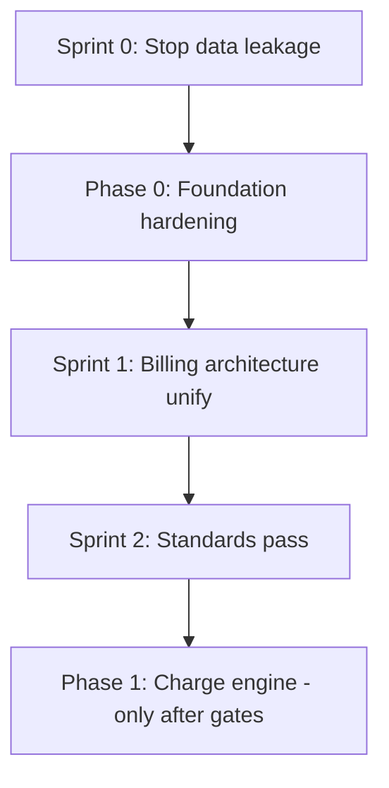

# Refactoring Execution Plan — First Things First

This plan refactors **existing code** to meet [STANDARDS.md](./STANDARDS.md) before new modules. It maps to **Phase 0** in [`project_document.md`](../../project_document.md) with a **Sprint 0** security prefix.

**Estimated calendar (2 senior full-stack):** Sprint 0 ≈ 3–5 days · Phase 0 ≈ 1 week · Stabilization ≈ 3–5 days.

---

## Overview

| Gate | Name | Blocks |
|------|------|--------|
| G0 | Sprint 0 complete | Any new feature UI or sales work |
| G1 | Phase 0 exit | Phase 1 charge UI expansion |
| G2 | Sprint 1 complete | Invoice engine (Phase 2) |
| G3 | Sprint 2 complete | Production multi-tenant onboarding |

---

## Sprint 0 — Stop data leakage (Days 1–5)

**Goal:** No cross-tenant reads via binding or aggregate endpoints.

### Day 1 — Model tenant scope

| Step | Task | Files | Done when |
|------|------|-------|-----------|
| 0.1.1 | Add `BelongsToCompany` to 9 models | `DEBT_REGISTER` C1 list | Trait on all; `creating` sets `company_id` |
| 0.1.2 | Verify factories set `company_id` | `database/factories/*` | Tests can create A/B companies |
| 0.1.3 | Fix `Building` duplicate scope if present | `Building.php` | Single scope only |

### Day 2 — Controller hotfixes

| Step | Task | Files | Done when |
|------|------|-------|-----------|
| 0.2.1 | Scope `ChargeTypeController::index` | `ChargeTypeController.php` | List returns one tenant only |
| 0.2.2 | Scope `BillingOperationsController::summary` | `BillingOperationsController.php` | Counts use auth `company_id` |
| 0.2.3 | Fix consolidation query | `BillingOperationsController`, billing services | `Agreement::active()` per company |
| 0.2.4 | Restrict `CompanyController` | `CompanyController.php` | Tenant users see own company only |
| 0.2.5 | Re-enable meter authorization | `MeterController.php` | 403 for wrong tenant |

### Day 3 — Policies & requests

| Step | Task | Done when |
|------|------|-----------|
| 0.3.1 | Register `MeterPolicy` + add ChargeType, ChargeModel, Company policies | `AuthServiceProvider` or `AppServiceProvider` |
| 0.3.2 | Wire `authorize()` in FormRequests or controllers | Policies invoked on mutate routes |
| 0.3.3 | Audit route model binding for scoped models | `show/update/destroy` return 404 cross-tenant |

### Day 4 — Tests (G0 evidence)

| Step | Task | Done when |
|------|------|-----------|
| 0.4.1 | Replace/extend `TenantIsolationTest` with HTTP tests | One test file per resource group |
| 0.4.2 | Minimum matrix: ChargeType, ChargeModel, Meter, MeterReading, Billing summary | All green in CI |
| 0.4.3 | Regression: existing Building/Tenant tests still pass | No scope regressions |

**Test file naming suggestion:**

- `tests/Feature/Tenancy/ChargeTypeIsolationTest.php`
- `tests/Feature/Tenancy/ChargeModelIsolationTest.php`
- `tests/Feature/Tenancy/MeterIsolationTest.php`
- `tests/Feature/Tenancy/BillingOperationsIsolationTest.php`

### Day 5 — Frontend leakage & wiring

| Step | Task | Files | Done when |
|------|------|-------|-----------|
| 0.5.1 | Remove duplicate interceptor; remove token logging | `api.js` | Single request interceptor |
| 0.5.2 | Fix invoice generate call | `InvoicesIndex.vue` | Authenticated `/api/v1/billing/...` |
| 0.5.3 | Register Charge Types routes + nav | `router/index.js`, `DashboardLayout.vue` | Pages reachable |
| 0.5.4 | Align ChargeType `status` field in UI | `ChargeTypeIndex.vue` | Matches API |
| 0.5.5 | Wire logout to auth store | `DashboardLayout.vue` | Token cleared on logout |
| 0.5.6 | Quarantine or hide bulk invoice stubs | Bulk invoice pages | Done — `BulkBillingQuarantined.vue` |

### Sprint 0 exit checklist (G0)

- [x] C1–C7 in [DEBT_REGISTER.md](./DEBT_REGISTER.md) marked Done or documented exception
- [x] Cross-tenant HTTP tests green (CI Postgres)
- [x] Manual smoke: `TenancySmokeTest` (two companies, core endpoints)
- [x] No raw `axios` for authenticated billing routes (bulk stubs quarantined)

---

## Phase 0 — Foundation hardening (Week 2)

Aligned with `project_document.md` Phase 0 tasks 0.1–0.5.

### 0.1 — Test suite baseline (2 days)

| Step | Task |
|------|------|
| P0.1.1 | Run full PHPUnit; document failures |
| P0.1.2 | Add GitHub Actions / CI: `composer test` on push |
| P0.1.3 | Enable coverage report (target ≥80% on touched modules) |
| P0.1.4 | PHPStan level 6+ on `app/` (incremental baseline) |

### 0.2 — Multi-tenancy tests (2 days)

| Step | Task |
|------|------|
| P0.2.1 | Isolation tests for: Building, Apartment, Tenant, Agreement, Meter, Payment |
| P0.2.2 | Verify `CompanyScope` on `GET` list + `GET/{id}` + `PUT` + `DELETE` |
| P0.2.3 | Document SYSTEM_ADMIN bypass in [TENANCY_CHECKLIST.md](./TENANCY_CHECKLIST.md) |

### 0.3 — Agreement state machine (3 days)

| Step | Task |
|------|------|
| P0.3.1 | Enum + transitions: DRAFT → PENDING → ACTIVE → TERMINATED / EXPIRED |
| P0.3.2 | `ProrateRentService` + tests |
| P0.3.3 | Reject billing on non-ACTIVE agreements (`BusinessRuleException`) |

### 0.4 — Meter reading tests (2 days)

| Step | Task |
|------|------|
| P0.4.1 | Fix 422 vs 500 (H11) in `MeterReadingController` |
| P0.4.2 | Approval irreversible; anomaly paths tested |
| P0.4.3 | Assert charge generation on approval (event or service call) |

### 0.5 — Financial precision audit (1 day)

| Step | Task |
|------|------|
| P0.5.1 | Migration: monetary columns → `decimal(14,4)` where safe |
| P0.5.2 | Replace float math in billing services with BCMath |
| P0.5.3 | DB checks: no negative posted balances |

### Phase 0 exit (G1)

Per `project_document.md`: CI operational, isolation verified, no float money math, agreement + meter reading tested.

**Status (2026-06-03):** **G1 CLOSED** — see [PHASE0_PROGRESS.md](./PHASE0_PROGRESS.md). Proceed to Phase 1.

---

## Sprint 1 — Billing architecture unify (Days 8–12)

**Goal:** One coherent invoice/charge pipeline.

| Order | Task | Resolves |
|-------|------|----------|
| 1.1 | **Decision record:** canonical invoice = `MonthlyInvoice` OR `Invoice` | H1 — write ADR in `docs/refactoring/adr/` |
| 1.2 | Align migrations to decision (FK names, `posted_to_invoice`, line items) | H2 |
| 1.3 | Refactor `InvoiceConsolidationService` to canonical schema | H2, H3 |
| 1.4 | Remove or redirect duplicate `/invoices` handlers | routes |
| 1.5 | Add `controls` to `ChargeModelResource` | H4 |
| 1.6 | Fix `meter_type` / `utility_type` naming | H5 |
| 1.7 | Unique constraint + idempotent `GenerateChargeService` | H6 |
| 1.8 | Guard `formula` strategy until implemented | M13 |

### Sprint 1 exit (G2)

- [x] Single invoice model used by consolidation + UI index (`MonthlyInvoice`)
- [x] End-to-end test: approved reading → charge → invoice line (`BillingPipelineTest`)
- [x] No duplicate `/invoices` controllers; `Invoice` deprecated (ADR 001)

---

## Sprint 2 — Standards pass (Days 13–17)

| Order | Task |
|-------|------|
| 2.1 | Introduce composables: `useChargeTypes`, `useChargeModels`, `useMeters`, `useBilling` |
| 2.2 | Migrate 2–3 pilot pages to composables + `controls` |
| 2.3 | Shared `ConfirmModal` component; replace `window.confirm` |
| 2.4 | Tenant-aware queue jobs (`company_id` in job payload) |
| 2.5 | Register `EventServiceProvider`; verify invoice PDF listeners |
| 2.6 | Hide/disable Payments UI until Phase 3 API ready |

### Sprint 2 exit (G3)

- [x] Frontend standards checklist in [FRONTEND_GUIDE.md](./FRONTEND_GUIDE.md) satisfied on pilot pages
- [x] BCMath in all charge calculation paths (Phase 0)
- [x] DEBT_REGISTER M3, M4, M12 done; M5–M8 remain for Phase 1 polish

---

## Phase 2 — Invoice engine (after Phase 1)

**Status (2026-06-03):** **CLOSED** — see [PHASE2_PROGRESS.md](./PHASE2_PROGRESS.md). Proceed to Phase 3.

---

## Phase 1 — Charge engine (only after G1 + G2)

**Status (2026-06-03):** **CLOSED** — see [PHASE1_PROGRESS.md](./PHASE1_PROGRESS.md).

Delivered:

1. **1A** — Charge Types frontend (worklist + modal CRUD)
2. **1B** — Charge Models backend (tier validation, versioning, clone)
3. **1C** — Charge Models UI (all strategies except formula; clone on index)
4. **1D** — Charge review API + UI; auto-sync on approve

**Phase 2 Invoice UI may begin** — invoice engine depends on stable charge records from this phase.

---

## Workstream split (parallel safe)

| Backend | Frontend |
|---------|----------|
| Sprint 0 Days 1–4 | Sprint 0 Day 5 |
| Phase 0.3–0.5 | Phase 0 composables (Sprint 2) after APIs stable |
| Sprint 1 consolidation | Charge Types/Models UI after G0 |

**Not parallel:** Invoice UI while H1 open; Sales module while Phase 3 open.

---

## Definition of done (per refactor task)

1. Code change merged
2. `DEBT_REGISTER` ID updated
3. Test added or extended
4. [STANDARDS.md](./STANDARDS.md) PR checklist passed
5. No new `Open` CRITICAL items introduced

---

## Suggested first PR sequence (minimal risk)

1. `feat(tenancy): BelongsToCompany on billing models`
2. `fix(tenancy): scope charge-types index and billing summary`
3. `test(tenancy): HTTP isolation for charge and meter resources`
4. `fix(frontend): api client and invoice generate auth`
5. `feat(frontend): charge-types routes and nav`

Start with PR 1–3 before any UI polish.
