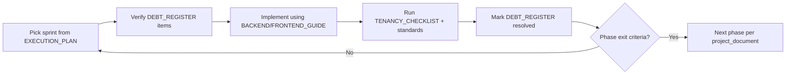

# AMSAAS Refactoring Reference — Index

This folder is the **single source of truth for refactoring** the existing codebase before new features. It complements (does not replace) the product master plan.

| Document | Purpose | Read when |
|----------|---------|-----------|
| [STANDARDS.md](./STANDARDS.md) | Non-negotiable backend/frontend/testing rules (from `project_document.md` §07 + foundation schema) | Every PR; onboarding |
| [DEBT_REGISTER.md](./DEBT_REGISTER.md) | Known architectural debt and data-leakage items with file paths and severity | Triage; sprint planning |
| [EXECUTION_PLAN.md](./EXECUTION_PLAN.md) | **First-things-first** refactor sequence (Sprint 0 → Phase 0 → Phase 1 gates) | Starting any refactor work |
| [TENANCY_CHECKLIST.md](./TENANCY_CHECKLIST.md) | Multi-tenant security checklist and test matrix | Model/controller changes |
| [BACKEND_GUIDE.md](./BACKEND_GUIDE.md) | Laravel patterns: scope, policies, services, API contract | Backend tasks |
| [FRONTEND_GUIDE.md](./FRONTEND_GUIDE.md) | Vue patterns: composables, controls, api client | Frontend tasks |
| [API_CONTRACT.md](./API_CONTRACT.md) | JSON envelope, `controls`, error shapes | API + UI alignment |

## Related project documents (repo root)

| File | Role |
|------|------|
| [`project_document.md`](../../project_document.md) | Phased master plan Phase 0→6, dependency chain, estimates |
| [`africaerp_foundation_schema.sql`](../../africaerp_foundation_schema.sql) | Foundation DB standards (UUID, `NUMERIC(14,4)`, enums, RLS intent) |
| [`TODO_AMSAAS_DEEP_REVIEW.md`](../../TODO_AMSAAS_DEEP_REVIEW.md) | Tactical bugs (422 vs 500 on meter readings, charge pipeline) |
| [`laravel/AMS SaaS project documents.md`](../../laravel/AMS%20SaaS%20project%20documents.md) | Module completion narrative |

## Cardinal rules (do not skip)

1. **No Phase N+1 until Phase N passes** exit criteria in `project_document.md`.
2. **No new UI** until the backing API is stable and tenant-safe.
3. **Fix data leakage before features** — see [EXECUTION_PLAN.md](./EXECUTION_PLAN.md) Sprint 0.
4. **One invoice domain** — do not extend both `MonthlyInvoice` and `Invoice` in parallel.

## How to use this pack

## Status tracking

Update `DEBT_REGISTER.md` **Status** column when an item is fixed (`Open` → `In progress` → `Done`). Link PRs or commit SHAs in the **Notes** column.

Last audit baseline: **2026-06-03** (pre-refactor security scan).
